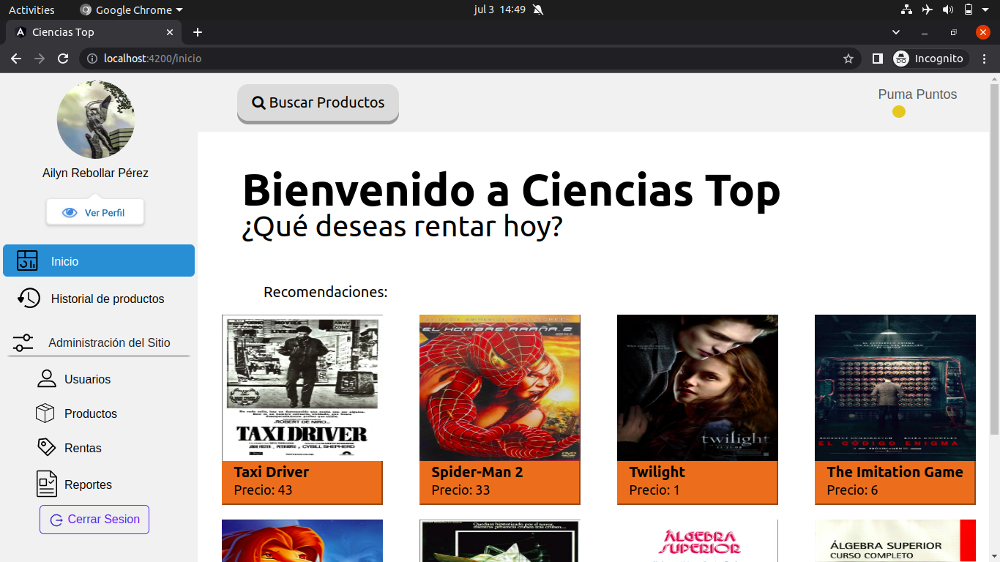
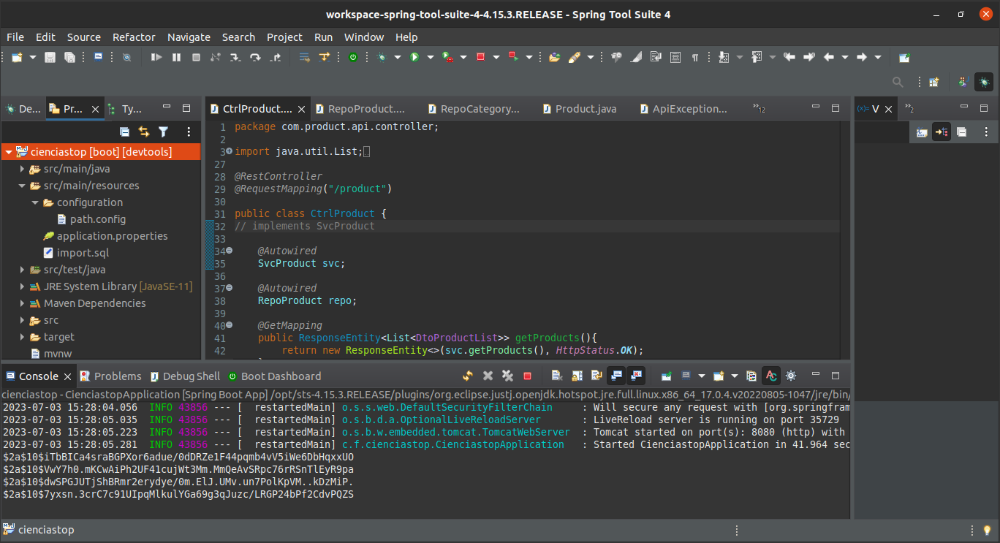
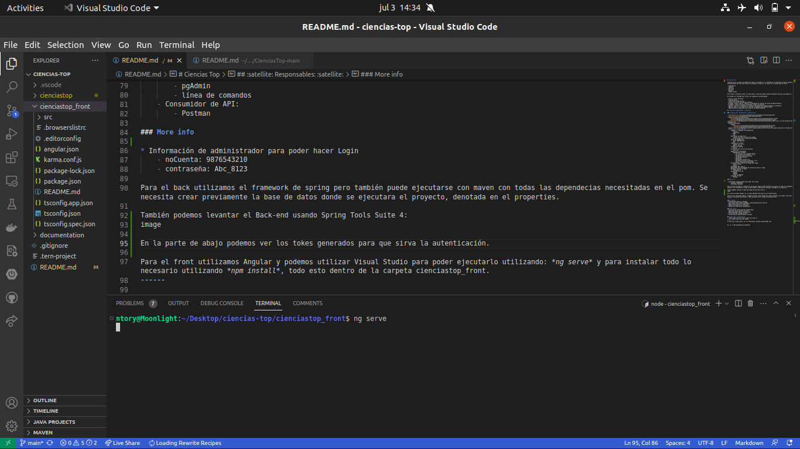
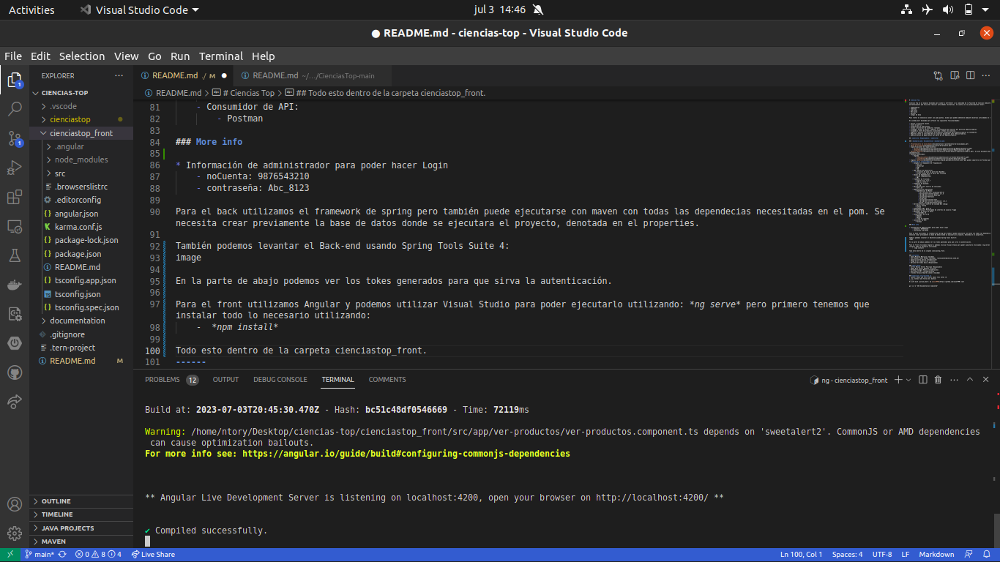
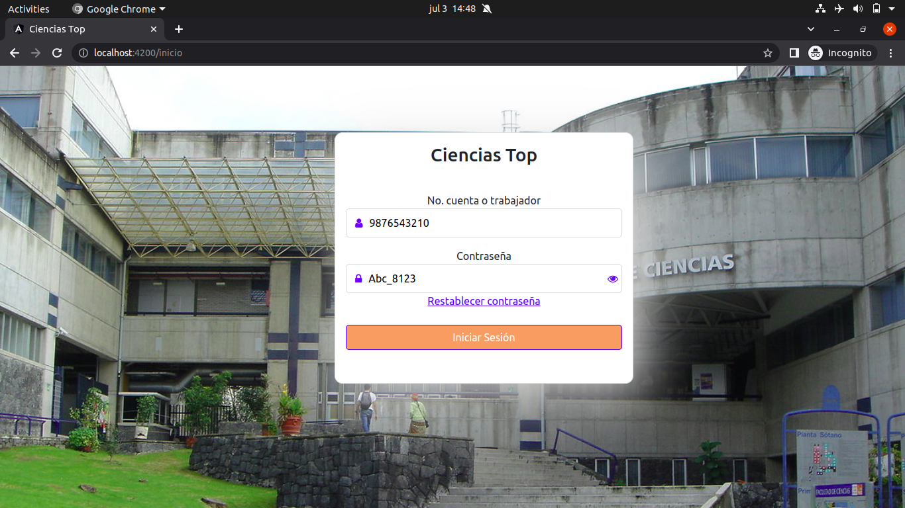
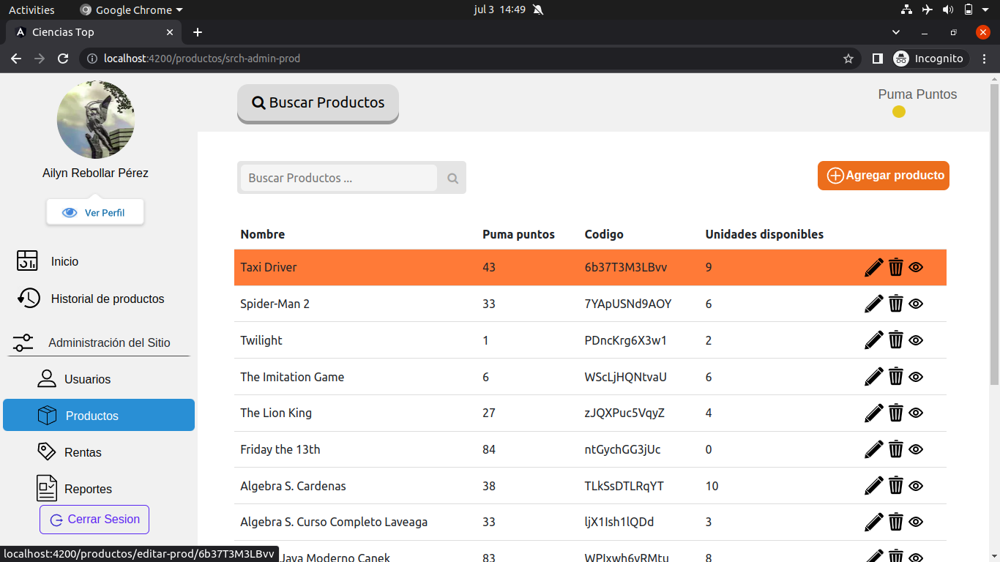
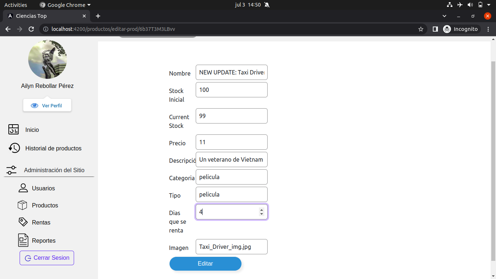
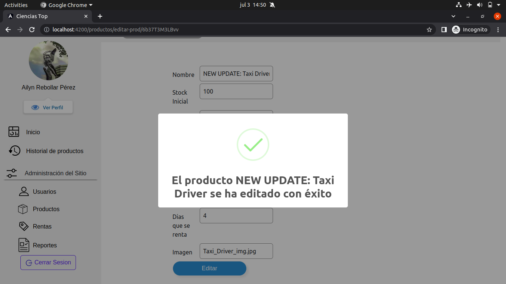
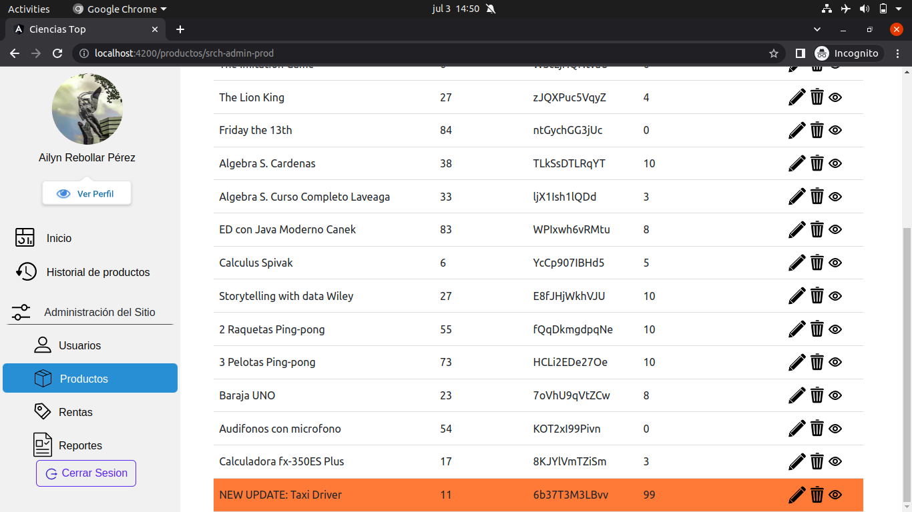

# Ciencias Top

|  |
|:---------------------------:|
| Menu principal de Ciencias Top |
------

Ciencias Top es un espacio diseñado para cuidar y entretener a la comunidad de la Facultad de Ciencias mediante la renta de productos de entretenimiento que faciliten realizar actividades recreativas. Se cuenta con la posibilidad de rentar:

- Computadoras
- Tabletas
- Audífonos
- Películas
- Balones
- Juegos de mesa

Para rentar es necesario contar con puma puntos, mismos que pueden obtenerse mediante diversas actividades en la facultad.

El sistema está diseñado para ofrecer las siguientes funcionalidades:

- Inicio y cierre de sesión.
- Vista de perfil.
- Acumulación de puma puntos.
- Acceso a historial de productos rentados.
- Búsqueda, acceso a perfil, registro y eliminación de usuarios por parte de administradores.
- Búsqueda y renta de productos accessible a todos los usuarios.
- Registro, edición y eliminación de productos disponible para administradores y proveedores.
- Reportes sobre la actividad de los usuarios disponible para administradores.
- Administración de puma puntos por parte de los administradores.

## :satellite: Responsables: :satellite:

### :bookmark_tabs: Documentation :bookmark_tabs:

- [Planteamiento de necesidades](documentation/1-plantamiento-de-necesidades.pdf)
- [Plan de proyecto](documentacion/2-plan-de-proyecto.pdf)
- Especificaciones de requerimientos:
    - [Primera](documentation/1ra-Iteracion/4-Especificacion-de-Requerimientos-LS.pdf)
    - [Segunda](documentation/2da-Iteracion/4-Especificacion-Requerimientos-TL.pdf)
- [Disenio general](documentation/1ra-Iteracion/5-Diseno-General-Arquitectura-BD-TL.pdf): En este documento definimos el ambiente de implementacion.
- Disenios detallados: 
    - Segunda
        - [TeamLeaviathan](documentation/2daIteracion/5.2-Diseno-detallado-TL.pdf)
        - [LoginSeven](documentation/2daIteracion/5.2-Diseno-detallado-LG.pdf)
- Algunos [queries](documentation/Ciencias_Top_db.postman_collection.json) que pueden importarse en Postman para probar nuestra API.
- **Tecnologías involucradas:**
    - Lenguaje (o lenguajes) de Programación: 
        - Java 11
        - JavaScript
        - HTML
        - CSS
    - IDE (Editor de desarrollo)
        - Eclipse 4.25 para la parte del BackEnd
        - Visual Studio para la parte del FrontEnd
    - Gestor de dependencias: 
        - Maven (dependencias)
        - XML
    - Framework de frontend:
        - Angular CLI: 14.2.7
        - Node.js v19.0.0
    - Framework de backend:
        - Spring
    - Herramienta para Control de versiones:
        - GIT 2.25
    - Repositorio de bibliotecas
        - Dependencias de Maven:
            - xml version="1.0" encoding="UTF-8"
            - Spring-boot-starter-parent: 2.7.5
            - spring-boot-starter-data-jpa
            - spring-boot-devtools
            - postgresql
            - spring-boot-starter-test
            - spring-boot-starter-validation: 2.6.3
            - Build: spring-boot-maven-plugin
    - Herramienta para Control de calidad del código:
        - Editor Config
        - Github
    - Diagramador UML: Draw.io
    - Herramienta para Prototipado de interfaz de usuario: Figma
    - Manejador de bases de datos
        - PostgreSQL 14
    - Visualizador de la BD
        - dbeaver
        - pgAdmin
        - línea de comandos
    - Consumidor de API:
        - Postman

### More info to execute

* Para el Back-End utilizamos el framework de spring pero también puede ejecutarse con maven con todas las dependecias necesitadas en el pom. Se necesita crear previamente la base de datos donde se ejecutara el proyecto, denotada en el properties.

    - También podemos levantar el Back-end usando Spring Tools Suite 4: En la parte de abajo podemos ver los tokes generados para que sirva la autenticación.

|  |
|:---------------------------:|
| Levantamiento del Back-End usando Spring Tools Suite 4 |

* Para el front utilizamos Angular y podemos utilizar Visual Studio para poder ejecutarlo utilizando: *ng serve* pero primero tenemos que instalar todo lo necesario utilizando:
    -  *npm install*
    - Se debe estar posicionado en `cienciastop_front/` y luego correr el comando

```shell
ng serve
```
|  |
|:---------------------------:|
| Levantamiento del Front-End usando VS ejecutando ng serve. |


|  |
|:---------------------------:|
| Tras ejecutar ng serve. |

* Información de un administrador para poder hacer un Login en la aplicación.
    - noCuenta: 9876543210
    - contraseña: Abc_8123

|  |
|:---------------------------:|
| Interfaz correspondiente al inicio de sesión. |
------

|  |
|:---------------------------:|
| Tras logearte, vemos el menu principal. |
------

#### Imagenes del caso de uso: Editar Productos

* Como administrador, podemos seleccionar un producto en "Productos" en la parte de "Administración del Sitio" para poder editar sus atributos.

|  |
|:---------------------------:|
| Antes de editar el producto seleccionado. |
------

* Una vez seleccionado puedes llenar el formulario que representa los atributos del producto seleccionado.
|  |
|:---------------------------:|
| Formulario que representa el producto seleccionado. |
------

* Tras dar click en editar, se verifica que los datos enviados cumplan los requisitos y si estos estan bien, se actualiza el producto seleccionado en la BD, el usuario ve la notificación correspondiente.
|  |
|:---------------------------:|
| Notificación tras editar. |
------

* Tras editar el producto, podemos darnos cuenta que el producto ha sido actualizado.
|  |
|:---------------------------:|
| Producto editado. |
------

### Leviathan:
- Ayala Morales Mauricio (Calidad)
- José Manuel Pedro Méndez (Calidad), <jose_manuel@ciencias.unam.mx>
- Ignacio Rivera Garcia (Colaboración)
- Diego Arturo Zamora Cruz (Técnico)
- Adriana Hernández Gasca (Responsable)

### Logic Seven:
- Cortés Macias Gretel Penélope (Responsable)
- Gómez Mora Héctor Eduardo (Técnico)
- Miranda Mijangos Mónica (Colaboración)
- Nuño Valdés Raúl (Colaboración)g
- Sánchez Velasco Eduardo Leonel (Calidad)

## Expressions of gratitude 🎁
* :punch: Share and tell others about this notes 📢
* :+1: Contact and follow me :bowtie:
------
⌨️ with much :purple_heart: by [Jose-MPM](https://github.com/Jose-MPM) 😊⌨️
